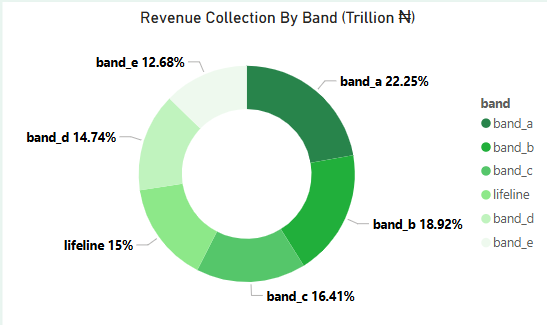
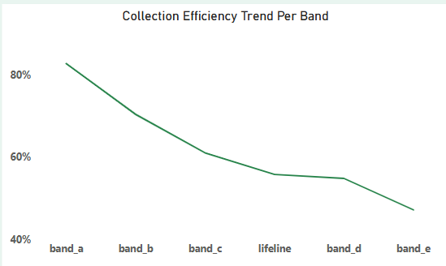
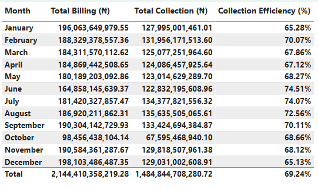
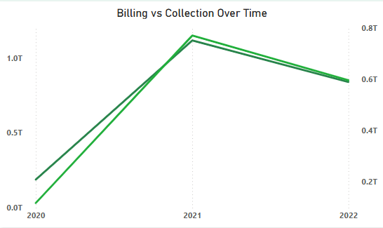

## Project Overview

This project delivers a comprehensive financial and operational analysis of electricity distribution, billing, and revenue collection in Nigeria from 2020 to 2022, based on official datasets sourced from the Nigerian Electricity Regulatory Commission (NERC). It focuses on key metrics such as billing efficiency, revenue collection, band-level performance, and revenue leakage across DisCos (Distribution Companies).

NERC, the primary regulator of the Nigerian electricity supply industry, publishes monthly service-level performance data across Nigeria’s 11 electricity Distribution Companies (DisCos) and customer service bands. These reports formed the basis for this analytical deep-dive.

The goal of this project is to:

* Uncover inefficiencies in billing and collection across customer bands (A to E)

* Measure and visualize revenue losses and collection performance

* Highlight regional disparities and customer group behaviors

* Compare Nigeria’s sector performance to international benchmarks (India, Kenya, South Africa)

Built using PostgreSQL and Power BI, the analysis offers insights for stakeholders, policymakers, consultants, and industry practitioners. The findings can be used to support data-driven reforms in Nigeria’s power sector.

---

## Tools Used

* **Excel / Power Query** — Data cleaning and wrangling
* **PostgreSQL** — Data transformation and querying
* **Power BI** — Data visualization
* **GitHub** — Project versioning and portfolio documentation

---

## Dataset & Source

**Raw File:** [DisCos Energy Sales by Service Bands Reports](https://github.com/franklinanalytics/Energy-Consumption-and-Revenue-Analysis/blob/main/datasets/DisCos%20Energy%20Sales%20by%20Service%20Bands%20Reports_Nov.20-Sep.2022_30122022.xlsx) (Excel) 

**Source:** Public datasets from [NERC.gov.ng](NERC.gov.ng)

All data was cleaned, normalized, and restructured for modeling purposes. See `/data_cleaning.md` for full documentation.
> *This is an independent project and not affiliated with NERC. All rights and credit go to the Nigerian Electricity Regulatory Commission for the original data.*
---

# SQL Data Model

**Database Tables:**

* `energy_dist` — Energy (kWh) delivered per DisCo and band
* `billing` — Amount billed in ₦ per DisCo and band
* `collection` — Amount collected in ₦ per DisCo and band

Loaded into PostgreSQL and created a **master view** joining all datasets by `disco`, `band`, and `billing_date`.

**View Created:** `master_energy_analysis`

**Structure:**

* `disco`
* `date`
* `band`
* `energy_kwh`
* `billing_naira`
* `collection_naira`

---
## Power BI Dashboard Structure

**Page 1: Intro Page**

**Page 2: Executive Summary**

* KPI Cards: Total Billing, Collection, Collection Efficiency
* Bar chart: DisCo-wise energy distribution and billing 

**Page 3: Executive Summary 2**

* Bar chart: DisCo-wise revenue collection
* Doughnut: Revenue by Band
* Slicer: Band, DisCo, Date

**Page 4: Trends and Time Series**

* Line chart: Billing vs Collection over time
* Table: Billing, Collection and Collection Efficiency over time

**Page 5: Revenue Leakage**

* Area chart: Revenue leakage by Disco
* Table: Revenue Leakage by Disco and Band

**Page 6: Band Performance**
* Column chart: Avg ₦/kWh per Band
* Line Chart: Collection Efficiency by Band
---

## Analysis & Insights

### 1. Energy Billing Rate

**Insight:**

Across most DisCos, Band A customers are billed between ₦50–₦70 per kWh, reflecting Nigeria’s target for premium service users. In contrast, Band E customers average below ₦30/kWh, aligning with the subsidized low-income lifeline structure.

However, inconsistencies were observed: in some DisCos, Band C or D billing overlaps with Band B, suggesting potential tariff misalignment or data quality issues.

**Recommendation:** Review and standardize tariff bands to ensure equitable billing and regulatory compliance.

### 2. Band Revenue Collection & Efficiency
<table>
  <tr>
    <td></td>
    <td></td>
  </tr>
</table>

**Insight:**

While Bands A and B show collection rates above 85%, Band E and Lifeline segments often fall below 50%, especially in areas like Benin and Yola. This reveals the financial pressure of servicing lower-income groups without corresponding recovery.

**Recommendation:** Implement targeted subsidy audits, prepaid meters, or enforce stricter credit enforcement mechanisms to reduce non-recoverable bills especially in low-income bands.

### 3. Disco Efficiency: Distribution & Revenue
**Distribution Efficiency**

**Revenue**

**Insight:**

Top DisCos by Energy Distributed:
Ikeja Electric (IE) – Leading in energy distributed.

EKEDC (Eko), IBEDC (Ibadan), and AEDC (Abuja) also reported strong energy throughput.

Top DisCos by Collection (₦):
Ikeja Electric (IE) – Highest total collection.

EKEDC, AEDC, and IBEDC followed.

Worst Performing DisCos by Revenue Loss:
Kaduna Electric (KE): ₦104.16 billion loss

BEDC: ₦95.97 billion loss

IBEDC: ₦94.38 billion loss

These three alone represent over 45% of national revenue leakages.

**Recommendation:** Prioritize metering, mprove mobile payments and education.

### 4. Revenue Leakage by DisCo

**Insight:**

Revenue leakage is highest in DisCos with low metering coverage and political exposure. For example, DisCos like Kaduna and Ibadan show up to ₦2–4 billion in annual revenue gaps, primarily due to poor collection from Band C–E.

**Recommendation:**   
Choose **Ikeja Electric (IE)** or **Eko Electric (EKEDC)** for reliable Band A power and industrial access.

---

## 🏙️ Recommended City: Lagos (Ikeja Industrial Zone)

- Band A zones with 20–24 hrs/day power
- Close to ports, airports, expressways
- Existing heavy industry and logistics network
- Independent Power Producers (IPPs) in the area

### Alternative: Abuja (AEDC - Band A)

- Government support
- Less congestion
- Good infrastructure in select zones

> **Only Band A zones** are suitable for energy-intensive industries.

## ✅ Final Recommendation

1. **Establish operations in Ikeja (Lagos) under Ikeja Electric**
2. Secure **Band A power** access or install a hybrid captive plant
3. **Use AI & robotics** to expand into power sector transformation (smart grids, battery storage)
4. Collaborate with government to drive **energy innovation and reform**

---

### 5. Monthly & Yearly Trends
<table>
  <tr>
    <td></td>
    <td></td>
  </tr>
</table>

**Insight:**

Billing values show upward trends year-on-year, but collection growth lags behind, especially after Q1 2021. This reflects Nigeria’s post-subsidy strain on end-users and inflation-induced debt accumulation.

Seasonality Observed: Mid-year performance tends to be better; year-end dips may link to festive load or enforcement fatigue.

Cashflow Volatility: A ~9% swing in monthly efficiency indicates uncertainty in returns, needing stronger collection systems.

**Recommendation:** Prepaid incentives and financing for debt reduction. 

---

## Benchmarking: Nigeria vs Global Standards

| Metric                        | Nigeria  | Kenya | India | South Africa |
| ----------------------------- | -------- | ----- | ----- | ------------ |
| Avg. Collection Efficiency    | \~65–75% | \~85% | \~90% | \~95%        |
| Billing Rate (₦/kWh)          | ₦20–60   | ₦25   | ₦22   | ₦65+         |
| Electrification Rate          | \~55%    | 75%   | 99%   | 85%          |
| Technical + Commercial Losses | 30–40%   | 22%   | 18%   | 10–15%       |

> *Source: IEA, World Bank Open Data*
---

## Conclusion:

Nigeria’s power sector is undergoing a major transformation. While challenges persist—particularly in collection inefficiencies, revenue leakage, and infrastructure shortfalls—the data clearly shows zones of high potential for strategic, technology-driven investments.

With over ₦659 billion in leakage and a 30% average shortfall in collections, there is ample room for commercial investment, especially in DisCos with high energy throughput and recoverable losses.

---

## 👨🏽‍💼 Author

**Franklin Durueke**

Data Analyst | Finance Analytics | Power Sector Strategy

[GitHub](https://github.com/franklinanalytics) · [LinkedIn](https://linkedin.com/in/durueke-franklin)

> For questions or collaborations, please reach out via [duruekefranklin@gmail.com](mailto:duruekefranklin@gmail.com)

---

  

> **Logo credit**: [NERC](NERC.gov.ng) — for educational and non-commercial purposes only.
